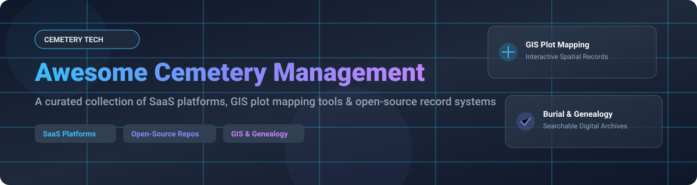

  

# 🪦 Awesome Cemetery Management Ecosystem

  
  
  
  
  

> **A curated, SEO-optimized list of top SaaS products, GIS plot mapping platforms, and open-source cemetery management systems.** 
> *Focusing on Plot Inventory Mapping 🗺️, Burial & Interment Records 📜, Crematory Management ⚱️, Work Orders 🛠️, and Genealogy Search 🔍.*

---

## 📚 Table of Contents
- [📊 Market Overview & Industry Insights](#-market-overview--industry-insights)
- [🌐 SaaS / Hosted Cemetery Platforms](#-saas--hosted-cemetery-platforms)
- [💻 Open-Source GitHub Repositories](#-open-source-github-repositories)
- [🤝 How to Contribute](#-how-to-contribute)
- [💖 Support & Sponsorship](#-support--sponsorship)
- [📈 Star History](#-star-history)
- [⚠️ Disclaimer](#%EF%B8%8F-disclaimer)

---

## 📊 Market Overview & Industry Insights

> 💡 **Market Size & Structure**: The global **Cemetery Management Software Market** is estimated at **$5.3 Billion - $11.6 Billion** (projected to reach $11.6B by 2032 at a CAGR of ~10.9%). The market is **highly fragmented**, served predominantly by specialized vertical vendors and regional software providers without a single "winner-take-all" dominant enterprise standard. Growth is driven by cloud migration, drone/GIS mapping integration, and digitizing legacy paper burial ledgers.

---

## 🌐 SaaS / Hosted Cemetery Platforms

| 🏢 Platform | 💰 Starting Price | 🎁 Free Tier / Trial Limit | 📊 Company Size / Valuation / Funding | 📝 Key Features & Description |
| :--- | :--- | :--- | :--- | :--- |
| **[PlotBox](https://www.plotbox.io/)** | \$500 / month (custom quote based on site size) | 14-day free demo / trial on request | **Est. \$20M - \$50M Valuation** (~100+ employees, Series A VC funded) | Enterprise cemetery software with GIS mapping, crematory management, financial contracts, & multi-site support. |
| **[CemSites](https://www.cemsites.com/)** | \$150 / month (base module tier) | 30-day guided interactive trial & live demo | **Est. \$10M - \$25M Revenue** (Mid-market leader, ~50 employees) | Cloud platform for cemeteries, funeral homes & crematories; plot mapping, burial records, work orders & CRM. |
| **[Chronicle Cemetery](https://chronicle.software/)** | \$49 / month (Basic digital tier) | Free tier available (Chronicle Basic for small cemeteries) | **Est. \$5M - \$15M Valuation** (Fast-growing niche provider, VC/Bootstrapped) | Done-for-you 3D/360° drone GIS mapping, digital records, and public memorial search for municipal & private cemeteries. |
| **[Cemify](https://www.cemify.com/)** | \$99 / month (Standard plan) | 14-day free trial (no credit card required) | **Est. \$2M - \$10M Revenue** (Independent SaaS vendor) | Modern, easy-to-use grave search, plot mapping, document vault, lot inventory, & public burial lookup. |
| **[CemeteryPro](https://www.cemeterypro.com/)** | \$120 / month | 14-day free trial | **Est. \$1M - \$5M Revenue** (Private business software) | Comprehensive administrative tools for plot sales, interment records, maintenance work orders, and billing. |
| **[Memorial Business Systems](https://www.memorialbusinesssystems.com/)** | \$200 / month (On-Prem / Hosted tier) | Free personalized demo (No self-serve free trial) | **Est. \$5M - \$15M Revenue** (Established 30+ yrs industry legacy provider) | Full-featured cemetery & memorial park management covering record keeping, accounting, sales, and work orders. |
| **[Legacy Mark](https://www.legacymark.com/)** | \$75 / month | 30-day free trial | **Est. \$1M - \$5M Revenue** (Specialized cemetery records vendor) | Cloud record-keeping and mapping tools tailored for historical, religious, and municipal cemetery grounds. |
| **[Memorial Mapping](https://www.memorialmapping.com/)** | \$100 / month | Free initial mapping sample / demo | **Est. \$1M - \$5M Revenue** (GIS-focused service & software vendor) | High-precision mapping-centric solutions linking digital plot maps directly to burial historical archives. |
| **[Cemetery Office](https://www.cemeteryoffice.com/)** | \$85 / month | 14-day free trial | **Est. \$1M - \$3M Revenue** (Small business software) | Simplified administrative office software for tracking plots, burials, deeds, and owner records. |
| **[CemeteryFind](https://www.cemeteryfind.com/)** | \$60 / month | Free public record lookup / demo tier | **Est. \< \$2M Revenue** (Web search & directory SaaS) | Public-facing grave search engine and municipal record management system for fast deceased retrieval. |

---

## 💻 Open-Source GitHub Repositories

| 📦 Repository | ⭐ Stars | 📜 License | 🧰 Tech Stack | 📌 Description & Focus |
| :--- | :--- | :--- | :--- | :--- |
| **[qgis/QGIS](https://github.com/qgis/QGIS)** |  | GPL-2.0 | C++, Python | Open-source Desktop GIS foundation widely used for georeferencing cemetery plot maps and spatial analysis. |
| **[gramps-project/gramps](https://github.com/gramps-project/gramps)** |  | GPL-2.0 | Python, GTK | Premier open-source genealogy software integrating family tree records with historical burial & cemetery data. |
| **[OpenGravestones/OpenGravestones](https://github.com/OpenGravestones/OpenGravestones)** |  | CC0-1.0 | GeoJSON-LD, Schema.org | Open-data schemas and standards for public-domain cemetery, gravestone, and burial metadata formats. |
| **[cityssm/sunrise-cms](https://github.com/cityssm/sunrise-cms)** |  | MIT | Node.js, SQLite / Express | Completely free municipal Cemetery Management System—records, work orders, contracts, and Find a Grave links. |
| **[bvcompsci/cemetery-map](https://github.com/bvcompsci/cemetery-map)** |  | MIT | Python, Flask, Google Maps | Web application enabling public grave search and interactive plot mapping using Google Maps API. |
| **[JaypeeFern/CemeteryManagementSystemDjango](https://github.com/JaypeeFern/CemeteryManagementSystemDjango)** |  | Open-Source | Python, Django, SQLite | Web portal for cemetery plot reservation, interment record management, and grave owner tracking. |
| **[teksi/cemetery](https://github.com/teksi/cemetery)** |  | GPL-3.0 | QGIS, PostGIS, Python | Full QGIS/PostGIS data model module for managing graves, columbaria, plots, deceased records & sectors. |
| **[issagomesdev/sjc-cemiterio](https://github.com/issagomesdev/sjc-cemiterio)** |  | MIT | PHP, Laravel | Municipal cemetery administration system tracking sectors, blocks, graves, ossuaries, death records & transfers. |

---

## 🤝 How to Contribute

1. **Fork** the repository 🍴
2. **Add/Edit** entries in `README.md` following the standard table format.
3. Ensure entries include verifiable pricing, free trial limits, or repository star badges.
4. **Submit a Pull Request** with a detailed explanation of your addition.

---

## 💖 Support & Sponsorship

If you find this curated cemetery management ecosystem resource helpful:
- ⭐ **Star** this repository on GitHub!
- 🔀 **Fork** and share it with municipal managers & software developers.
- ☕ **Sponsor the Project**: Consider buying us a coffee via our [GitHub Sponsor Dashboard](https://github.com/sponsors/ishandutta2007)!

---

## 📈 Star History

---

## ⚠️ Disclaimer

- This repository is a **community-curated list** for informational and educational purposes.
- Cemetery management systems process sensitive historical, legal, and personal data. Open-source deployments should strictly enforce authentication, role-based access control, and privacy compliance.
- Prices, valuations, and features are subject to change by respective vendors.

---

  Maintained with ❤️ for cemetery directors, municipal administrators, software engineers, and genealogists worldwide.

